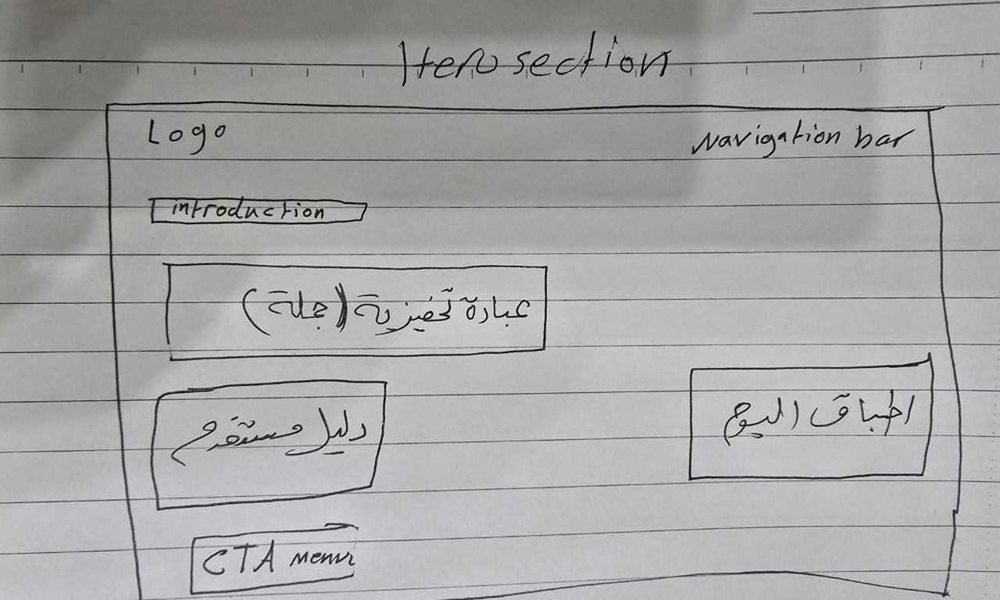
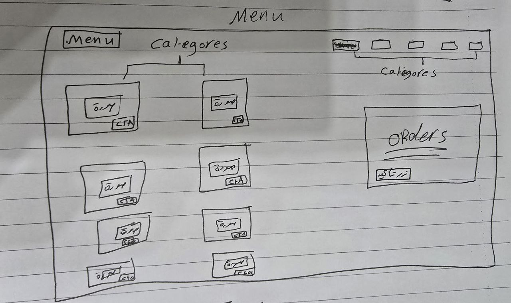
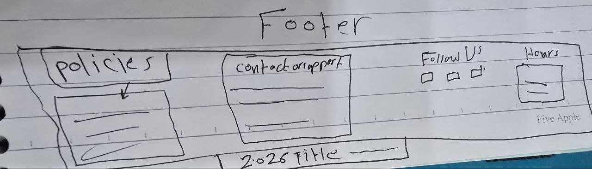

# Restaurant Ordering System Workflow

## نظرة عامة على النظام

نظام طلبات مطعم متكامل يعمل على الويب مع واجهة مستخدم حديثة واتصال مباشر بـ Google Sheets لتسجيل الطلبات.

---

## المميزات الرئيسية

### 🎨 **التصميم والواجهة**
- **تصميم عصري** مع دعم الوضع الفاتح والداكن
- **ريسبونسيف كامل** يدعم جميع أحجام الشاشات
- **سايد بار للموبايل** للتنقل السهل
- **رسوم متحركة سلسة** وانتقالات احترافية

### 📱 **المكونات الرئيسية**

#### **1. الهيدر (Header)**
- **شعار المطعم** مع نص "Restaurant System"
- **قائمة تنقل** (Home, Menu, Your Order)
- **زر تبديل الثيم** (فاتح/داكن)
- **قائمة موبايل** للشاشات الصغيرة

#### **2. قسم الهيرو (Hero Section)**
- **صورة خلفية** جذابة
- **عنوان رئيسي** ووصف مع تأثيرات بصرية
- **نص برتقالي** مع مربع أسود في الوضع الفاتح
- **زر دعوة للعمل** للانتقال للمنيو

#### **3. قسم المنيو (Menu Section)**
- **فلاتر الأصناف** (All, Burgers, Sides, Drinks, Desserts)
- **بطاقات المنتجات** مع الصور والأسعار
- **أزرار الإضافة** للطلب
- **عرض ديناميكي** حسب الفلتر المختار

#### **4. لوحة الطلب (Order Panel)**
- **عرض الطلبات** الحالية مع الكميات
- **التحكم في الكميات** (زيادة/نقصان)
- **حساب التوتال** تلقائيًا
- **زر إتمام الطلب** (Place Order)

#### **5. نافذة التأكيد (Checkout Modal)**
- **فورم بيانات العميل** (اسم، هاتف، بريد، عنوان)
- **اختيار طريقة الدفع** (كاش/إلكتروني)
- **عرض ملخص الطلب** بالتفصيل
- **حساب التوتال** النهائي

---

## سير العمل (Workflow)

### 🔄 **خطوات المستخدم**

#### **1. استعراض المنيو**
1. **فتح الموقع** - يظهر المنيو بكل الأصناف
2. **تصفية الأصناف** - اختيار فئة معينة (برجر، مشروبات، إلخ)
3. **عرض المنتجات** - كل منتج مع صورة ووصف وسعر

#### **2. إضافة الطلبات**
1. **اختيار المنتج** - الضغط على زر "Add to Order"
2. **تحديث اللوحة** - يظهر المنتج في لوحة الطلب
3. **تعديل الكمية** - زيادة أو نقصان الكمية
4. **حساب التوتال** - يتم تحديث المجموع تلقائيًا

#### **3. إتمام الطلب**
1. **الضغط على Place Order** - يفتح نافذة التأكيد
2. **ملء البيانات**:
   - الاسم الكامل
   - رقم الهاتف
   - البريد الإلكتروني
   - عنوان التوصيل
   - طريقة الدفع
3. **مراجعة الطلب** - عرض تفاصيل الطلب والتوتال
4. **إرسال الطلب** - يذهب إلى Google Sheet

#### **4. تأكيد الإرسال**
1. **إرسال إلى Google Sheet** - يتم تسجيل البيانات
2. **مسح الطلب** - تفرغ لوحة الطلب
3. **إغلاق النافذة** - العودة للصفحة الرئيسية

---

## التكامل التقني

### 📊 **Google Sheets Integration**

#### **البيانات المرسلة:**
- **Name** - اسم العميل
- **Email** - البريد الإلكتروني
- **Phone** - رقم الهاتف
- **Address** - عنوان التوصيل
- **orderItems** - تفاصيل الأصناف المطلوبة
- **totalPrice** - السعر الإجمالي

#### **الرابط المستخدم:**
```
https://script.google.com/macros/s/AKfycbxZuCt2lHY4Gg4ziBMoOSvwmJiuhkJHN09kxGG0MDl3frrtzsiyJMKhXxHfNmtnkHH4/exec
```

### 🎨 **التصميم المتجاوب**

#### **أحجام الشاشات المدعومة:**
- **Ultra Large** (1400px+) - شاشات كبيرة جداً
- **Large Desktop** (1200px+) - شاشات مكتبية كبيرة
- **Medium Desktop** (992px+) - شاشات مكتبية متوسطة
- **Tablet Landscape** (768px+) - تابلت أفقي
- **Tablet Portrait** (600px+) - تابلت عمودي
- **Large Mobile** (480px+) - موبايل كبير
- **Small Mobile** (320px+) - موبايل صغير

#### **الميزات الخاصة:**
- **سايد بار موبايل** للشاشات ≤ 768px
- **تخطيط مرن** يتكيف مع حجم الشاشة
- **أحجام خطوط متغيرة** للقراءة السهلة

---

## إدارة الثيمات

### 🌙 **الوضع الداكن (Dark Mode)**
- **الخلفية السوداء** مع نصوص بيضاء
- **ألوان هادئة** للرؤية المريحة
- **تباين عالي** للوضوح

### ☀️ **الوضع الفاتح (Light Mode)**
- **الخلفية البيضاء** مع نصوط داكنة
- **ألوان زاهية** ومشرقة
- **نصوص برتقالية** للعناوين المهمة

---Wireframe
  

## بنية الملفات

### 📁 **الهيكل التنظيمي**
```
project 4/
├── index.html          # الصفحة الرئيسية
├── styles.css          # ملف الأنماط
├── script.js           # ملف الجافاسكريبت
├── assets/             # مجلد الصور
│   └── sweets.jpg     # صورة الهيرو
└── .windsurf/
    └── workflows/
        └── restaurant-workflow.md  # هذا الملف
```

### 🔧 **المكونات الرئيسية**

#### **HTML (index.html)**
- **هيكل الصفحة** الدلالي (Semantic HTML5)
- **نافذة المودال** لتأكيد الطلب
- **فورم البيانات** مع حقول الإدخال
- **عناصر الوصول** (ARIA labels)

#### **CSS (styles.css)**
- **متغيرات CSS** للألوان والأحجام
- **أنظمة الشبكات** (Grid & Flexbox)
- **الرسوم المتحركة** والانتقالات
- **الريسبونسيف** والـ Media Queries

#### **JavaScript (script.js)**
- **إدارة الحالة** (State Management)
- **معالجة الأحداث** (Event Handling)
- **الاتصال بـ API** (Google Sheets)
- **التحقق من صحة** (Form Validation)

---

## تجربة المستخدم (UX)

### 🎯 **نقاط القوة**
- **سهولة الاستخدام** - واجهة بديهية
- **سرعة الأداء** - تحميل سريع
- **وصولية عالية** - يدعم قارئات الشاشة
- **توافق كامل** - يعمل على جميع المتصفحات

### 🔄 **تدفق المستخدم**
1. **اكتشاف** → استعراض المنيو
2. **اختيار** → إضافة المنتجات
3. **مراجعة** → التحقق من الطلب
4. **إتمام** → إرسال البيانات
5. **تأكيد** → استلام الرسالة

---

## الصيانة والتطوير

### 🔧 **التحديثات المستقبلية**
- **إضافة المزيد من الأصناف**
- **نظام تقييم المنتجات**
- **تتبع حالة الطلب**
- **ربط ببوابات الدفع**
- **تطبيق موبايل** (PWA)

### 🐛 **المشاكل الشائعة وحلولها**
- **مشاكل الاتصال** - التحقق من الرابط والصلاحيات
- **مشاكل الريسبونسيف** - اختبار على مختلف الأجهزة
- **مشاكل الأداء** - ضغط الصور وتحسين الكود

---

## الخلاصة

نظام طلبات المطعم هو حل متكامل يجمع بين:
- **تصميم عصري** وسهل الاستخدام
- **وظائف كاملة** لإدارة الطلبات
- **تكامل سلس** مع Google Sheets
- **دعم كامل** لجميع الأجهزة

النظام جاهز للاستخدام الفوري ويمكن توسيعه بسهولة حسب احتياجات العمل.

